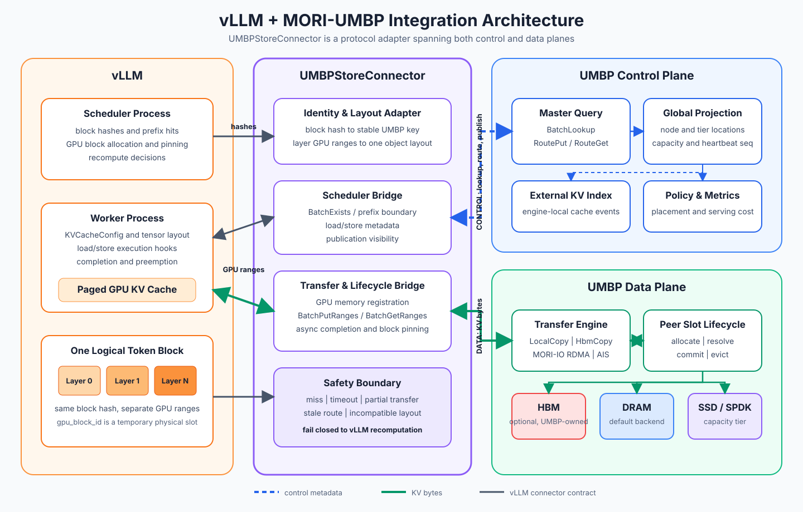
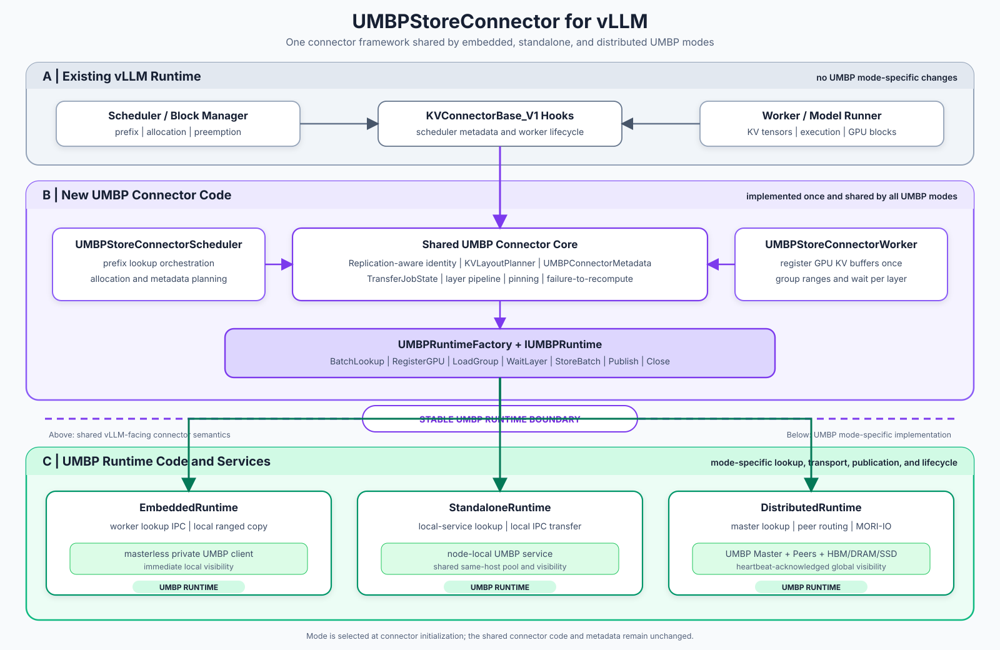

# [RFC]: Scheduler-Aware Multi-Tier KV Caching for vLLM with MORI-UMBP

## Motivation

vLLM's GPU prefix cache is bounded by accelerator memory. CPU offloading can
extend capacity within an engine, while an external KV store can preserve and
reuse prefixes across engines, DP ranks, nodes, and engine restarts. The open
[vLLM UMBP feature request](https://github.com/vllm-project/vllm/issues/48191)
tracks this need for AMD deployments.

MORI-UMBP provides an AMD-focused storage path with HIP-visible GPU-buffer
registration, NUMA-aware host DRAM, MORI-IO RDMA, SSD backends, tier-placement
policy, and scheduler-visible KV location and hit metadata. Integrating it into
vLLM provides several concrete benefits:

- **Shareable capacity:** standalone UMBP places the node-local KV pool in a
  separate process so DP ranks and model instances can share DRAM. This also
  allows round-robin traffic to reuse KV across DP ranks.
- **Direct GPU-to-store movement:** grouped ranged operations move between
  registered vLLM KV buffers and UMBP without requiring a connector-owned
  contiguous host staging copy.
- **Cache lifetime independent of the engine:** standalone storage survives
  worker restart or rolling upgrade, avoiding a complete host-cache warm-up.
- **Global placement and routing:** distributed UMBP can use cluster-wide
  capacity and location information instead of making every placement or
  eviction decision from one rank's local view.
- **Replication-aware storage:** byte-identical TP replicas can share one
  object identity in shared storage, while rank-sharded data retains distinct
  shard identity. Writer election can additionally reduce duplicate traffic
  when every reader can reach the elected writer's object.
- **Layer-wise overlap:** grouped ranged I/O, batched offload, and per-layer
  completion allow later-layer KV loading to overlap earlier-layer compute.
- **Tiered capacity:** UMBP can extend the same object namespace from DRAM to
  SSD and optional UMBP-owned HBM without adding medium-specific branches to
  the vLLM connector.

The initial integration should not require a redesign of vLLM's connector API.
`MooncakeStoreConnector` provides a useful structural precedent: one
`KVConnectorBase_V1` implementation dispatches to scheduler-side
lookup/planning and worker-side registration/transfer logic.

`UMBPStoreConnector` follows that vLLM-facing structure while keeping UMBP
semantics behind `IUMBPRuntime`. Embedded mode is worker-private and
masterless; standalone mode shares a node-local service; distributed mode uses
Master routing, peer-owned slots, MORI-IO, and heartbeat-acknowledged
publication. Identity, layout, metadata, completion, preemption, and
failure-to-recompute remain common across all three modes.

## Proposed Change

### Summary

This RFC proposes adding one vLLM V1 `UMBPStoreConnector` backed by
MORI-UMBP. It follows the proven scheduler/worker organization of
`MooncakeStoreConnector` while keeping UMBP-specific lookup, transfer, and
publication semantics behind `IUMBPRuntime`.

The connector supports embedded, standalone, and distributed UMBP modes
without duplicating vLLM-facing code. All modes share replication-aware object
identity, KV layout, grouped/layer-wise transfer planning, metadata, job
lifecycle, pinning, completion, and failure-to-recompute behavior; only
runtime topology and data movement differ.

Implementation proceeds through small PRs, beginning with the shared connector
framework and embedded mode, then adding standalone and distributed runtimes.
A broader backend-neutral connector for UMBP, Mooncake, and other stores is
recorded as an open architectural discussion and does not block UMBP delivery.

### Goals

- Add one vLLM V1 `UMBPStoreConnector` following the existing
  `KVConnectorBase_V1` scheduler/worker lifecycle.
- Support embedded, standalone, and distributed UMBP modes through one shared
  connector framework.
- Select the UMBP runtime mode at connector initialization without changing
  scheduler/worker connector code.
- Use vLLM content-derived block hashes, never physical GPU block IDs, as the
  basis of persistent object identity.
- Make object identity replication-aware per KV-cache group:
  - sharded TP data keeps a logical shard/rank component;
  - byte-identical TP replicas use one shared object key when the selected
    runtime storage is shared by those ranks;
  - private embedded pools retain the physical copy needed by each process,
    even if their logical key is identical.
- Avoid redundant writes only when the runtime can prove that one writer's
  object is visible to every rank that will read it. Key deduplication and
  writer election are separate optimizations.
- Keep KV layout planning, connector metadata, transfer job state, pinning,
  completion, and recomputation logic common across all modes.
- Use UMBP ranged Put/Get operations for non-contiguous GPU KV regions.
- Support both bulk and layer-wise execution through the shared framework:
  submit grouped asynchronous range operations, wait only for the layer about
  to execute, and batch completed-layer offloads.
- Register vLLM GPU KV allocations once and pass registered GPU regions
  directly to UMBP/MORI-IO without connector-owned contiguous staging.
- Treat missing, evicted, timed-out, stale, or partially transferred objects
  as cache misses and safely recompute them.
- Keep UMBP transport, routing, and publication details out of vLLM scheduler,
  model-runner, and attention code.
- Incubate through `kv_connector_module_path` against a pinned vLLM revision
  before considering upstream registration.

### Architecture



_Figure 1. `UMBPStoreConnector` bridges vLLM's scheduler and worker lifecycle
to UMBP's control and data planes. vLLM owns request scheduling and GPU KV
blocks; UMBP owns routing, transfer, publication, and tiered storage._



_Figure 2. Existing vLLM code calls one connector. Shared
`UMBPStoreConnectorScheduler`, `UMBPStoreConnectorWorker`, replication-aware
identity, layer/range planning, and job state sit above `IUMBPRuntime`.
Embedded, standalone, and distributed implement only the mode-specific runtime
operations._

The architectural boundary is:

```text
Existing vLLM
  Scheduler / Worker / KVConnectorBase_V1
                     |
                     v
Shared UMBPStoreConnector
  Scheduler | Worker | Metadata | Replication/Layout
  Layer Pipeline | Job State | Failure Handling
                     |
                     v
               IUMBPRuntime
          /           |            \
   Embedded       Standalone      Distributed
 private pool    local service    Master + Peers
 local copy      local IPC        MORI-IO RDMA
```

`IUMBPRuntime` exposes lookup, direct GPU-buffer registration, grouped load,
per-layer wait, batched store, publication, and shutdown operations. Runtime
handles receive UMBP keys and transfer plans rather than vLLM request or
attention objects.

The shared identity planner classifies each cache group as rank-sharded or
rank-replicated. It retains shard identity for different bytes and collapses
the TP key component for byte-identical replicas only when runtime visibility
allows those ranks to share one stored object.

For layer-wise loading, the worker submits grouped range operations before
model execution. `wait_for_layer_load(layer_name)` waits only for ranges needed
by that layer, allowing later-layer transfer to overlap earlier-layer compute.
Bulk mode remains a valid implementation that reports all layers ready
together.

The four related capabilities have separate meanings:

- **Layer-wise loading** controls readiness and overlap: each attention layer
  waits for only its own KV.
- **Grouped ranged multi-buffer I/O** describes many non-contiguous K/V ranges
  in one UMBP submission instead of creating a contiguous staging object.
- **Batched offload** combines multiple completed blocks or layers to reduce
  submission, RPC, and synchronization overhead.
- **Direct GPU-buffer registration** registers vLLM KV allocations once so
  local copy or MORI-IO can access GPU memory without a connector-owned host
  copy.

These capabilities require an UMBP-specific worker/runtime adapter. The
current `MooncakeStoreConnector` explicitly leaves `wait_for_layer_load()` and
`save_kv_layer()` as no-ops, so its bulk lifecycle cannot simply be copied for
this path. Current MoRIIO code implements per-layer wait/save hooks. LMCacheMP
exposes the same vLLM hooks and batched retrieval, but its current
`wait_for_layer_load()` and `save_kv_layer()` are also no-ops; it is not
evidence of equivalent per-layer readiness semantics.

Mode-specific behavior is confined below this boundary:

- **Embedded:** worker lookup bridge, private masterless client, local ranged
  transfers, immediate visibility.
- **Standalone:** node-local service lookup and transfer, shared same-host
  ownership, no cluster Master or RDMA requirement.
- **Distributed:** Master lookup/routing, peer slot operations, MORI-IO RDMA,
  and heartbeat-acknowledged global visibility.

### Compatibility

The initial integration targets a deliberately narrow compatibility range:

- vLLM V1 against one pinned revision while `KVConnectorBase_V1` remains
  experimental;
- decoder-only MHA/GQA models using a supported paged KV-cache layout;
- PP size 1;
- TP size 1 initially, followed by TP size 2 or greater before the shared
  framework is considered complete;
- full, hash-aligned KV blocks;
- replication-aware object identity per cache group: rank-sharded bytes retain
  shard identity, while byte-identical replicas may share one key in a shared
  runtime;
- bulk all-layer transfer as the fallback path;
- layer-wise loading for attention backends and UMBP runtimes that support
  grouped ranged I/O and per-layer completion;
- `kv_producer`, `kv_consumer`, and `kv_both` roles;
- embedded mode with DRAM;
- standalone mode with a node-local service and DRAM;
- distributed mode with DRAM and MORI-IO RDMA.

Objects are reusable only when the model identity, model revision, KV dtype,
block size, attention layout, TP/PP topology, cache-group description, and
object-layout version match. These fields are included in the key namespace so
an incompatible object becomes a miss rather than being loaded.

MLA, hybrid attention/Mamba, heterogeneous KV-cache groups, PP greater than 1,
SSD policies, and UMBP-owned HBM are follow-up extensions. Replication-aware
identity is part of the initial framework even when the first model matrix does
not exercise every replicated layout. Unsupported layout or layer-wise
capability combinations must fail during initialization or explicitly fall
back to bulk transfer.

### Test Plan

#### Shared connector tests

- [ ] Verify deterministic keys and namespace isolation, including distinct
  identities for TP-sharded bytes and collapsed keys for byte-identical
  replicas when runtime visibility permits sharing.
- [ ] Verify replication-aware storage scope: private embedded pools retain
  one physical copy per process, while shared runtimes can deduplicate a
  replicated object.
- [ ] Verify writer election independently from key deduplication and disable
  it unless every reader can reach the elected writer's object.
- [ ] Verify KV-layout extraction, grouped non-contiguous range construction,
  and scheduler/worker metadata round-trip.
- [ ] Verify consecutive-prefix matching, TP-rank completeness, and
  failure-to-recompute behavior.
- [ ] Verify block pinning, preemption, per-key completion, and safe GPU block
  reuse.
- [ ] Verify the layer-wise pipeline end to end: one-time GPU registration,
  grouped load submission, per-layer readiness, later layers remaining in
  flight, and batched offload.
- [ ] Run the same runtime contract suite against fake, embedded, standalone,
  and distributed runtimes, and verify that changing `mode` does not change
  connector metadata, key format, range layout, or error semantics.

#### Embedded mode

- [ ] Verify repeated-request prefix reuse, byte-identical KV restoration, and
  output equivalence with recomputation.
- [ ] Verify eviction between lookup and load, asynchronous save completion,
  and safe GPU block reuse.
- [ ] Verify grouped/layer-wise local ranged I/O without Master, RDMA fabric,
  or external storage service.

#### Standalone mode

- [ ] Verify two workers or engines reuse objects through one node-local
  service, including replicated TP ranks consuming one stored object.
- [ ] Verify concurrent-client behavior and namespace isolation.
- [ ] Verify disconnect, restart, timeout, and eviction degrade to a miss or
  explicit load error followed by recomputation.

#### Distributed mode

- [ ] Verify a block produced on one node is reused on another through Master
  routing, peer slot resolution, MORI-IO, and direct GPU registration, with
  byte-identical restoration.
- [ ] Verify TP completeness and sharded-versus-replicated identity across
  nodes.
- [ ] Verify stale routes, remote eviction, peer/RDMA failure, and Master
  timeout/restart degrade safely to recomputation.
- [ ] Verify a store is not globally visible before heartbeat publication is
  acknowledged.
- [ ] Verify grouped ranged I/O and per-layer completion over the distributed
  path.

#### Performance

- [ ] Measure cold/cache-hit TTFT, lookup latency, load/store latency, and
  effective bandwidth for every mode.
- [ ] Measure asynchronous-save overhead, CPU utilization, and hit behavior
  under eviction.
- [ ] Measure standalone local-IPC contention and distributed local/remote
  transfer, NIC scaling, and Master/publication overhead.
- [ ] Compare with normal vLLM recomputation and the relevant existing
  connector.

### PR Roadmap

The PRs are ordered so that the common framework lands before mode-specific
runtime implementations:

- [ ] **[UMBP][vLLM] Add shared UMBPStoreConnector core and IUMBPRuntime contract**
  - Add the `KVConnectorBase_V1` role dispatcher, shared scheduler/worker
    components, connector metadata, replication-aware key/layout planning,
    `IUMBPRuntime`, configuration validation, and fake-runtime unit tests.
  - Define bulk and layer-wise transfer-plan contracts here so later modes do
    not need to change connector metadata.
  - This PR implements the common connector layer shown above; it does not
    include embedded, standalone, or distributed runtime implementations.

- [ ] **[UMBP][vLLM] Add embedded mode**
  - Add worker-private, masterless DRAM storage, scheduler-to-worker lookup,
    local ranged Put/Get, direct GPU-buffer registration, completion, and
    failure-to-recompute coverage.

- [ ] **[UMBP][vLLM] Add standalone mode**
  - Connect scheduler and workers to a node-local UMBP service so multiple
    engines can share one DRAM pool.
  - Cover local IPC, service lifecycle, namespace isolation, and replicated-TP
    key deduplication within the service's visibility scope.

- [ ] **[UMBP][vLLM] Add distributed mode**
  - Add Master lookup/routing, peer slot allocation and resolution, MORI-IO
    RDMA, heartbeat-acknowledged publication, and distributed failure
    handling.

- [ ] **[UMBP][vLLM] Add SSD tier support**
  - Enable file/io_uring and SPDK-backed capacity tiers through UMBP policy,
    including DRAM-to-SSD offload, promotion, eviction, and tier metrics.
  - Keep medium selection below `IUMBPRuntime`; the connector key and metadata
    remain unchanged.

- [ ] **[UMBP][vLLM] Add cache-aware routing**
  - Publish UMBP-owned and engine-local KV placement events and expose
    scheduler-visible hit/capacity information.
  - Allow a router to prefer an engine or node that can reuse the longest
    prefix without putting routing policy inside `UMBPStoreConnector`.

- [ ] **[UMBP][vLLM] Add layer-wise KV loading**
  - Submit grouped ranged multi-buffer loads before model execution and make
    `wait_for_layer_load(layer_name)` wait only for the current layer.
  - Add batched offload, direct registered-GPU paths, transfer/compute overlap
    validation, and bulk-mode fallback.

### Open Discussion: Backend-Neutral Connector Interface

The current `KVConnectorBase_V1` API standardizes lifecycle hooks, but each
storage integration still generally implements its own connector class,
scheduler component, worker component, metadata, lookup tracking, completion,
preemption, and error handling. UMBP, Mooncake, NIXL, and other offloading
connectors therefore repeat a substantial amount of structure.

A possible future vLLM abstraction is:

```text
KVConnectorBase_V1
        |
        v
StorageBackendConnector
  shared scheduler/worker lifecycle
  canonical metadata, key, range plan, pinning, completion
        |
        v
IStorageBackend
  Capabilities | Lookup | RegisterBuffers
  Load | Store | Wait | Publish | Close
        |
        +-- UMBPBackend
        +-- MooncakeBackend
        +-- FutureBackend
```

The comparison to a dynamic library is conceptual: the same connector code is
initialized with one backend implementation selected by configuration. It
does not require a C/C++ shared library and does not imply runtime
hot-switching.

Compared with implementing one complete connector per storage system, this
could:

- eliminate repeated scheduler/worker forwarding and metadata scaffolding;
- centralize prefix, TP-completeness, pinning, preemption, and
  failure-to-recompute fixes;
- provide one conformance suite for storage backends;
- add a storage system through one backend implementation rather than another
  complete `KVConnectorBase_V1` implementation;
- select UMBP, Mooncake, or another backend without changing connector code.

The unresolved risk is whether one interface can preserve optimized behavior
across different stores. UMBP and Mooncake differ in key limits, allocation
ownership, scatter/gather support, replication, publication, cancellation,
and per-key errors. The abstraction could become too weak for optimized paths
or too large with optional capabilities.

The current lookup lifecycle is another constraint:
`get_num_new_matched_tokens()` returns only `(token_count, load_async)` and
does not carry an opaque lookup/reservation plan into
`update_state_after_alloc()`. Reservation-based stores may need a generic
prepare/commit/abort external-match lifecycle.

This discussion does not block `UMBPStoreConnector`. The proposed shared UMBP
core and `IUMBPRuntime` boundary provide concrete implementation experience
that can later inform a backend-neutral vLLM interface.

Questions to resolve:

1. Which semantics belong in generic vLLM code versus a storage backend?
2. Can UMBP and Mooncake satisfy the same contract without losing optimized
   transfer or publication behavior?
3. Which backend capabilities are mandatory, and which can use safe defaults?
4. Should a backend expose one factory or separate scheduler/worker handles?
5. Should vLLM add an opaque external-match plan with prepare, commit, and
   abort operations?

## Feedback Period

The proposed feedback period is at least one week after this RFC is posted to
the vLLM community. The architecture and first PR boundary should be agreed
before implementation begins; mode-specific details can continue to evolve in
their corresponding PRs.

## Any Other Things

### References

- [MORI repository](https://github.com/ROCm/mori)
- [SGLang MORI-UMBP RFC](https://github.com/sgl-project/sglang/issues/27898)
- [vLLM MoRI UMBP offloading support feature request](https://github.com/vllm-project/vllm/issues/48191)
- [vLLM Mooncake Store shared-cache RFC](https://github.com/vllm-project/vllm/issues/38474)
- [MooncakeStoreConnector implementation tracker](https://github.com/vllm-project/vllm/issues/40900)
- [vLLM KVConnectorBase_V1 source](https://github.com/vllm-project/vllm/blob/main/vllm/distributed/kv_transfer/kv_connector/v1/base.py)
- [vLLM MooncakeStoreConnector source](https://github.com/vllm-project/vllm/blob/main/vllm/distributed/kv_transfer/kv_connector/v1/mooncake/store/connector.py)
- [vLLM MoRIIOConnector source](https://github.com/vllm-project/vllm/blob/main/vllm/distributed/kv_transfer/kv_connector/v1/moriio/moriio_connector.py)
- [vLLM LMCacheMPConnector source](https://github.com/vllm-project/vllm/blob/main/vllm/distributed/kv_transfer/kv_connector/v1/lmcache_mp_connector.py)
- [SGLang UMBP external linker with layer-wise ranged I/O](https://github.com/sgl-project/sglang/pull/37578)
- [SGLang UMBP replicated MLA/DSA key deduplication](https://github.com/sgl-project/sglang/pull/38778)
- [MORI UMBP ranged multi-buffer APIs](https://github.com/ROCm/mori/pull/540)
